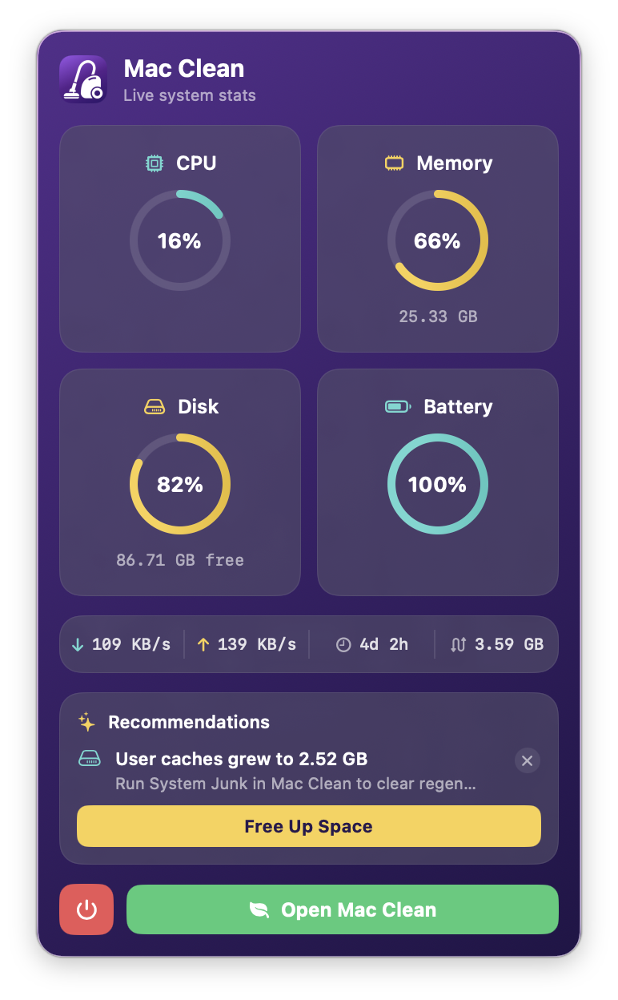

<p align="center">
  
</p>

<h1 align="center">Mac Clean</h1>

<p align="center">
  <strong>The open-source Mac cleaner, optimizer, and malware scanner.</strong><br>
  A feature-complete, free alternative to CleanMyMac — built with Swift 6 and SwiftUI.
</p>

<p align="center">
  
  
  
  
  
  
</p>

<p align="center">
  
</p>

<p align="center">
  <strong>Install in one command:</strong>
</p>

```bash
brew tap iliyami/macclean && brew install --cask mac-clean
```

<p align="center">
  Or grab the <a href="https://github.com/iliyami/MacClean/releases/latest">latest DMG</a> from Releases.
</p>

---

## What is Mac Clean?

Mac Clean is a **free, open-source** macOS app that cleans junk files, removes malware, optimizes performance, uninstalls apps completely, and visualizes disk usage — all from a single, beautiful interface. It replicates every major feature of CleanMyMac while being fully transparent and community-driven.

**No subscriptions. No telemetry. No ads. Just a clean Mac.**

## How Mac Clean compares

|  | Mac Clean | CleanMyMac | Pearcleaner | PureMac | OnyX | Mole |
|---|:---:|:---:|:---:|:---:|:---:|:---:|
| **Price** | Free | $39.95/yr | Free | Free | Free | Free (CLI) |
| **Open source** | ✅ BSD-3 | ❌ | ✅ Fair-code | ✅ MIT | ❌ | ✅ MIT |
| **Telemetry** | ❌ None | ⚠️ Yes | ❌ None | ❌ None | ❌ None | ❌ None |
| **Native GUI app** | ✅ | ✅ | ✅ | ✅ | ✅ | ❌ CLI (paid GUI separate) |
| **Smart Scan (one-click)** | ✅ | ✅ | ❌ | ➖ Partial | ❌ | ➖ Interactive CLI |
| **System Junk (16 categories)** | ✅ | ✅ | ➖ | ✅ | ➖ Limited | ✅ |
| **Universal Binary thinning** | ✅ | ✅ | ❌ | ❌ | ❌ | ❌ |
| **Malware scanner** | ✅ | ✅ | ❌ | ❌ | ❌ | ❌ |
| **Browser privacy cleaner** | ✅ | ✅ | ❌ | ❌ | ➖ | ❌ |
| **Uninstaller with leftover detection** | ✅ 10-level | ✅ | ✅ Focus | ❌ | ❌ | ✅ |
| **Disk treemap visualizer** | ✅ | ❌ | ❌ | ❌ | ❌ | ➖ Analyzer |
| **Duplicate finder** | ✅ | ✅ | ❌ | ❌ | ❌ | ❌ |
| **Menu bar system monitor** | ✅ | ✅ Menu | ❌ | ❌ | ❌ | ❌ |
| **Maintenance scripts** | ✅ | ✅ | ❌ | ❌ | ✅ Strong | ➖ |
| **In-app activity log viewer** | ✅ | ❌ | ❌ | ❌ | ❌ | N/A CLI |
| **Notarized by Apple** | ❌ | ✅ | ✅ | ✅ | ✅ | N/A |
| **macOS version** | 14+ | 13+ | 13+ | 13+ | varies | varies |

> CleanMyMac is a great product — they deserve the revenue from users who want a polished, supported experience. Mac Clean is for everyone who'd rather have transparent source code and zero subscription.

## Features

### Cleanup
| Module | Description |
|--------|------------|
| **Smart Scan** | One-click scan combining cleanup, protection, and performance analysis with live progress across 13 modules |
| **System Junk** | 16 scan categories — user/system caches, logs, language files, broken preferences, broken login items, document versions, iOS backups, Xcode junk, **Universal Binary thinning** (detects fat Mach-O binaries with both arm64 and x86_64 slices and rewrites them to your native arch via `lipo`), deleted users, and more |
| **Mail Attachments** | Find cached attachments from Apple Mail, Outlook, and Spark |
| **Trash Bins** | Empty trash from all locations including external drives |

### Protection
| Module | Description |
|--------|------------|
| **Malware Removal** | Signature-based scanning with 3 depths (Quick / Balanced / Deep), checks launch agents/daemons, browser extensions, and known malware patterns |
| **Privacy** | Clean Safari, Chrome, and Firefox data — history, cookies, cache. System traces cleanup with time filters |

### Performance
| Module | Description |
|--------|------------|
| **Optimization** | Manage login items and launch agents with enable/disable toggles |
| **Maintenance** | 10 system tasks — free RAM, run maintenance scripts, repair permissions, rebuild Launch Services, reindex Spotlight, flush DNS, thin Time Machine snapshots. Tasks are tagged with severity (safe / disruptive) and "Run All" requires explicit confirmation; long-running tasks can be cancelled mid-flight |

### Applications
| Module | Description |
|--------|------------|
| **Uninstaller** | 10-level app matching engine that finds every associated file across 17+ Library subdirectories. Complete removal, app reset, unused app detection |
| **Updater** | Check for available updates across installed apps via Sparkle appcast feeds |

### Files
| Module | Description |
|--------|------------|
| **Space Lens** | Squarified treemap visualization of disk usage with drill-down navigation |
| **Large & Old Files** | Find files >50 MB sorted by size and last access date |
| **Duplicates** | Progressive detection — size grouping → partial SHA-256 (4KB) → full hash → inode verification |
| **Shredder** | Secure file erasure with standard, permanent, and secure overwrite modes |

### Menu Bar Widget

<p align="center">
  
</p>

A glassmorphism menu bar widget that puts your Mac's vitals one click away — an independent process that launches at login and is toggled from the app's sidebar. No need to open the main window just to check in.

- **Live stat rings** — CPU load, memory pressure, disk usage, and battery in a 2×2 ring grid (`host_processor_info`, `vm_statistics64`, APFS capacity, IOKit power source), color-graded green → amber → red
- **Network, uptime & swap** — real-time up/down throughput, system uptime, and swap usage
- **Recommendations** — actionable, dismissible tips ("User caches grew to 2.52 GB — run System Junk") with one-tap actions, suppressed for 30 days once dismissed
- **Protection status** — last malware-scan time and threat count, color-coded by freshness
- **Connected devices** — external volumes (with free space) and external displays at a glance
- **Health alerts** — background notifications when disk runs critically low or memory pressure stays high (throttled, opt-in)
- **One click to the app** — jump straight into Mac Clean

## Architecture

```
Mac Clean
├── MacClean          — Main SwiftUI app (14 modules, 15 views)
├── MacCleanKit       — Shared framework (models, constants, protocols)
├── MacCleanHelper    — XPC privileged helper (LaunchDaemon for root ops)
├── MacCleanMenu      — Menu bar monitor (independent process)
└── MacCleanTestRunner — Standalone test suite (56 tests)
```

### Tech Stack

| Layer | Technology |
|-------|-----------|
| Language | Swift 6 with strict concurrency |
| UI | SwiftUI + AppKit hybrid |
| Concurrency | Actors, TaskGroup, async/await, @Sendable |
| Database | GRDB.swift (SQLite) with WAL mode |
| File Scanning | URLResourceKey prefetching on APFS |
| Incremental Updates | FSEvents with historical replay |
| Privileged Ops | SMAppService + NSXPCConnection |
| System Stats | Mach APIs (host_processor_info, vm_statistics64, proc_pidinfo) |

### Safety Model

Mac Clean is designed to **never cause data loss**:

- **Protected paths blocklist** — `/System`, `/usr`, `/bin`, `/sbin`, Apple system apps are untouchable
- **macOS firmlink canonicalization** — `/var`↔`/private/var`, `/tmp`↔`/private/tmp`, `/etc`↔`/private/etc` resolved to a single canonical form so symlink-redirect detection doesn't false-positive on legitimate system paths
- **Pre-scan cleanability filter** — items the current process couldn't trash (root-owned children of system caches, macOS data-vaulted dirs under `~/Library/Caches/com.apple.*`) are dropped at scan time so they never reach the UI as cleanable
- **Trash-first deletion** — all removals go to Trash by default
- **Dry-run mode** — preview what would be deleted without touching anything
- **TOCTOU prevention** — symlinks re-resolved immediately before deletion
- **Chunked cleanup** — large selections (50k+) prompt a confirmation modal; the engine splits the work into 5k-item chunks honoring `Task.isCancelled` between chunks so cancellation is responsive
- **Recursive byte accounting** — directory size is walked instead of stat'd, so the "X freed" count on the completion screen reflects reality
- **Orphan safety policy** — orphan cleanup restricted to caches/logs only
- **In-app activity log viewer** — every error during clean is logged with full path; the post-clean screen has a "View Log" button that opens an in-app sheet with errors-only filter and copy-to-clipboard so you can paste a bug report verbatim. Logs auto-prune after 30 days
- **Kernel-enforced XPC privilege gate** — the privileged helper uses `NSXPCListener.setCodeSigningRequirement` (macOS 13+) so the kernel itself rejects connections from any process whose code signature doesn't match the main app's identifier and team

## Installation

### Homebrew (recommended — one command, no warnings)

```bash
brew tap iliyami/macclean
brew install --cask mac-clean
```

The Cask automatically handles Gatekeeper for you. Launch from Spotlight or Applications — no warnings, no right-clicks, no commands.

### One-line installer

```bash
curl -fsSL https://raw.githubusercontent.com/iliyami/MacClean/main/scripts/install.sh | bash
```

This downloads the latest DMG, installs the app to `/Applications`, and removes the quarantine flag automatically.

### DMG download

Download the latest DMG from [Releases](https://github.com/iliyami/MacClean/releases/latest) and drag Mac Clean to your Applications folder. On first launch, either right-click the app and choose **Open**, or run once:

```bash
sudo xattr -dr com.apple.quarantine "/Applications/Mac Clean.app"
```

### Build from source

```bash
git clone https://github.com/iliyami/MacClean.git
cd MacClean
swift build
swift run MacCleanTestRunner   # run 56 tests
bash scripts/build-dmg.sh      # build local DMG
```

### Granting Full Disk Access

Some modules (Mail Attachments, Privacy, Malware) need Full Disk Access to scan protected areas:

1. Open **System Settings → Privacy & Security → Full Disk Access**
2. Click **+** and add **Mac Clean.app** from Applications
3. Restart Mac Clean

## Why Mac Clean isn't notarized by Apple

Apple charges **$99/year** for a Developer ID — the only way to bypass Gatekeeper warnings on macOS. Mac Clean is free, open-source, and built by volunteers. Paying Apple's annual gatekeeping tax just so users can open the app without a warning isn't worth it when:

1. The source is right here for you to read
2. Homebrew install handles it automatically — `brew install --cask mac-clean` and you're done
3. The one-line installer handles it automatically
4. The whole "Gatekeeper warning" thing is just an extra `xattr` command for direct DMG installs

If our community ever wants to fund a Developer ID (or some other open-source organization wants to sponsor one), we'll happily ship notarized builds. Until then, **no paywall just to launch a free app**.

For maintainers with a Developer ID who want to ship notarized builds:

```bash
export APPLE_DEVELOPER_ID='Developer ID Application: Your Name (TEAMID)'
xcrun notarytool store-credentials 'MacClean' --apple-id YOU@example.com --team-id TEAMID
export NOTARY_PROFILE='MacClean'
bash scripts/build-dmg.sh --notarize
```

## Requirements

- macOS 14 (Sonoma) or later
- For building from source: Swift 6 toolchain (Xcode 16+)

## Project Structure

```
Sources/
├── MacClean/
│   ├── App/                    # App entry point, state, content view
│   ├── Core/
│   │   ├── Scanner/            # FileTreeScanner, TargetedScanner, ScanCoordinator
│   │   ├── Cleaner/            # CleaningEngine, SafetyGuard
│   │   ├── Cache/              # GRDB database layer
│   │   └── FSMonitor/          # FSEvents incremental watcher
│   ├── Modules/                # 13 scan modules
│   │   ├── SystemJunk/         # 16 junk categories
│   │   ├── Malware/            # Signature scanner + real-time monitor
│   │   ├── Uninstaller/        # 10-level app matching engine
│   │   ├── SpaceLens/          # Squarified treemap algorithm
│   │   ├── Duplicates/         # Progressive hash pipeline
│   │   └── ...
│   ├── Views/                  # SwiftUI views (14 module views + shared components)
│   ├── ViewModels/             # @Observable view models
│   ├── Services/               # PermissionManager, XPCClient
│   └── Utilities/              # SuperEllipse shape, extensions
├── MacCleanKit/                # Shared models, constants, protocols
├── MacCleanHelper/             # XPC privileged helper (root operations)
├── MacCleanMenu/               # Menu bar system monitor
└── MacCleanTestRunner/         # 56 standalone tests
```

## Tests

```bash
swift test
```

XCTest-based suite covering:

- **`SafetyGuard`** — 24 adversarial tests (symlinks, traversal, NULL bytes, SIP, protected apps, file caps, idempotence)
- **`CleaningEngine`** — 9 integration tests (dry-run, trash, permanent, error handling, operation log)
- **`PlistJunkFilter`** — 9 tests including Apple-system-domain safety contract
- **`ScanCoordinator`** state machine — scan/cancel/category-filter/include-heavy
- **`TargetedScanner`** integration — runs against synthetic temp directory fixtures
- **All 16 system junk categories** — pure target declarations + the filter logic on the procedural ones (`BrokenPreferences`, `BrokenLoginItems`, `UniversalBinaries`, `DeletedUsers`)
- **`SquarifiedTreemap`** — empty, single, multi-node, area conservation, aspect-ratio properties
- **`AppMatching`** — all 10 levels of the uninstaller pattern engine
- **`DuplicateDetection`** — size groups, partial/full hash groups, inode dedup
- **`MalwareSignatures`** — name patterns + suspicious launch agent payloads
- **`MaintenanceTask`** — all 10 tasks have descriptions, icons, executable paths
- **`FileGroup`** — by-size / by-type / by-age grouping
- **`AppcastParser`** — Sparkle XML parsing
- **`VolumeInfo`** — usage math, equality
- **`AppDatabase`** — GRDB cache CRUD, migrations, invalidation
- **`FSEventMonitor`** — invalidated-path computation
- **`AppDiscovery`**, **`AppPathFinder`** — smoke tests
- **End-to-end** — synthetic fixture → scan → results → clean cycle

Test infrastructure (`Tests/MacCleanTestSupport/`) provides `withTempHome`, `withFakeApp`, `withFakePlist`, and other fixture helpers so tests stay deterministic and never touch the user's real home.

Coverage target: **85%+ overall**, **100% on `SafetyGuard` and `CleaningEngine`** (the death-and-life files). See [`docs/TESTING.md`](docs/TESTING.md) for the full roadmap.

## Security

Mac Clean takes security seriously:

- **No network access** — the app never phones home, no telemetry, no analytics
- **No elevated privileges by default** — XPC helper only activated for maintenance tasks
- **Code signature verification** — XPC helper validates caller identity
- **Protected paths** — 27+ Apple system apps and all SIP-protected paths are blocklisted
- **Open source** — every line of code is auditable

### Security Audit Checklist

- [x] No command injection vectors (all Process args are hardcoded constants)
- [x] No arbitrary file deletion (SafetyGuard validates every path)
- [x] TOCTOU race condition prevention (symlink re-resolution before delete)
- [x] File operation caps (10,000 file limit per operation)
- [x] XPC caller validation (code signature check)
- [x] No secrets or credentials in source
- [x] Trash-first policy (recoverable by default)
- [x] Operation audit log (every action recorded)

## Contributing

We welcome contributions! Please read our [Contributing Guidelines](CONTRIBUTING.md) before submitting a PR.

### Quick Start

1. Fork the repo
2. Create a feature branch (`git checkout -b feature/amazing-feature`)
3. Make your changes
4. Run tests (`swift run MacCleanTestRunner`)
5. Commit (`git commit -m 'Add amazing feature'`)
6. Push (`git push origin feature/amazing-feature`)
7. Open a Pull Request

## License

This project is licensed under the **BSD 3-Clause License** — see the [LICENSE](LICENSE) file for details.

This means you can use, modify, and redistribute this code, but you **must**:
- Include the original copyright notice
- Include the license text
- **Not** use the name "Mac Clean" or contributors' names to endorse derived products without permission

## Acknowledgments

Inspired by the open-source Mac utility community:
- [Pearcleaner](https://github.com/alienator88/Pearcleaner) — app uninstaller patterns
- [Mole](https://github.com/tw93/Mole) — cleanup categories
- [Tencent Lemon Cleaner](https://github.com/Tencent/lemon-cleaner) — modular architecture
- Squarified Treemap algorithm by Bruls, Huizing & van Wijk (2000)

---

<p align="center">
  <strong>Mac Clean is free software built by the community, for the community.</strong><br>
  If you find it useful, please star the repo and share it with others.
</p>
